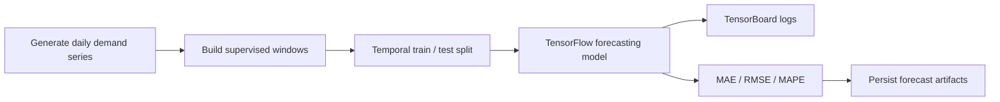

# time-series-forecasting-tensorflow

## Português

`time-series-forecasting-tensorflow` é um projeto de previsão temporal com `TensorFlow/Keras` e acompanhamento de treino com `TensorBoard`, desenhado para mostrar como estruturar um experimento de forecasting com janelas temporais, avaliação fora da amostra e persistência de artefatos.


### Objetivo arquitetural

O projeto foi estruturado para mostrar um experimento de forecasting pequeno, mas com disciplina de engenharia. Em vez de tratar a série temporal como um vetor genérico de números, o pipeline deixa explícitos os elementos que normalmente importam em produção:

- materialização da série de entrada;
- transformação da sequência em problema supervisionado;
- preservação da ordem temporal no split;
- treino do modelo;
- medição do erro fora da amostra;
- persistência das previsões e do sumário final.

Essa organização é importante porque forecasting não é apenas modelagem: é também controle de como o tempo entra no problema.

### Arquitetura do projeto

- [src/data_factory.py](src/data_factory.py)
- [src/modeling.py](src/modeling.py)
- [main.py](main.py)
- [tests/test_project.py](tests/test_project.py)

### Papel técnico de cada arquivo

- [src/data_factory.py](src/data_factory.py)
  gera a série temporal sintética com tendência e sazonalidade, persistindo a base bruta em `CSV`.
- [src/modeling.py](src/modeling.py)
  constrói janelas supervisionadas, executa o treino principal com `TensorFlow/Keras`, aplica o fallback com `MLPRegressor`, calcula métricas e grava os artefatos do run.
- [main.py](main.py)
  executa o pipeline de ponta a ponta e imprime o sumário consolidado.
- [tests/test_project.py](tests/test_project.py)
  valida o contrato mínimo do pipeline usando thresholds compatíveis com o runtime local validado.

### Pipeline



### Estratégia de modelagem

O pipeline converte a série em aprendizado supervisionado por meio de janelas deslizantes:

- cada amostra de entrada contém os `14` valores anteriores;
- o alvo é o próximo valor da série;
- o split é temporal, sem embaralhamento, preservando a causalidade do problema.

Quando `tensorflow` está disponível, o caminho principal usa uma arquitetura `Keras Sequential` baseada em:

- `Input(shape=(14, 1))`
- `LSTM(32)`
- `Dense(16, activation="relu")`
- `Dense(1)`

Essa escolha foi feita para mostrar um modelo temporal simples, mas suficientemente expressivo para capturar dependências locais de curto prazo.

Quando `tensorflow` não está disponível, o projeto faz fallback para `MLPRegressor`, tratando cada janela como um vetor tabular. Isso preserva a executabilidade do repositório, mas deixa explícito que o runtime validado localmente não corresponde ao caminho neural temporal preferencial.

### Resultados atuais

- `runtime_mode = fallback_without_tensorflow`
- `row_count = 240`
- `window_size = 14`
- `train_window_count = 180`
- `test_window_count = 46`
- `mae = 11.1760`
- `rmse = 12.4578`
- `mape = 11.1146`

### Interpretação das métricas

- `MAE`
  mede o erro absoluto médio em unidades da própria série.
- `RMSE`
  penaliza com mais força erros maiores e ajuda a perceber instabilidades mais severas.
- `MAPE`
  mede o erro percentual médio e ajuda na leitura executiva do forecast.

No runtime validado, os erros refletem o caminho `fallback_without_tensorflow`. Isso significa que o benchmark atual serve principalmente para demonstrar estrutura de pipeline, logging e avaliação temporal reproduzível.

### Artefatos gerados

- série temporal materializada:
  [data/raw/daily_demand_series.csv](data/raw/daily_demand_series.csv)
- previsões fora da amostra:
  [data/processed/forecast_values.csv](data/processed/forecast_values.csv)
- relatório consolidado:
  [data/processed/time_series_forecasting_report.json](data/processed/time_series_forecasting_report.json)
- modelo persistido:
  [artifacts/best_model.joblib](artifacts/best_model.joblib)
- histórico do run:
  [logs/fit/20260401-174656/history.json](logs/fit/20260401-174656/history.json)

### Contrato do relatório final

O relatório consolidado registra:

- `runtime_mode`
- `row_count`
- `window_size`
- `train_window_count`
- `test_window_count`
- `mae`
- `rmse`
- `mape`
- `dataset_artifact`
- `forecast_artifact`
- `model_artifact`
- `tensorboard_log_dir`
- `history_artifact`
- `report_artifact`

### Como usar o TensorBoard

Quando `tensorflow` estiver disponível, os logs de treino são gravados em `logs/fit/<timestamp>`. O comando esperado para inspeção é:

```bash
tensorboard --logdir logs/fit
```

Na prática, isso permitiria observar:

- convergência de `loss` ao longo das épocas;
- divergência entre treino e validação;
- estabilidade do treino;
- comparação entre múltiplos runs.

No ambiente validado aqui, o projeto executou com `fallback_without_tensorflow`, então o diretório de logs contém uma nota de runtime em vez de curvas completas de época.

## English

`time-series-forecasting-tensorflow` is a forecasting project built with `TensorFlow/Keras` and `TensorBoard`, designed to show how a temporal prediction experiment can be structured around supervised windows, out-of-sample evaluation, and reproducible artifacts.

### Architectural intent

The repository is structured to make the forecasting workflow explicit instead of hiding it inside a single notebook. It separates:

- raw series materialization;
- supervised window generation;
- temporal split;
- model training;
- out-of-sample evaluation;
- artifact persistence.

This is especially important in forecasting, where preserving temporal order is part of the problem definition itself.

### Modeling path and fallback

The preferred runtime uses a simple `TensorFlow/Keras` sequence model built around:

- `LSTM(32)`
- a dense hidden layer
- a scalar regression output

When `tensorflow` is unavailable, the repository falls back to `MLPRegressor`. That keeps the project executable while clearly distinguishing the validated local runtime from the preferred temporal neural path.

### Current results

- `runtime_mode = fallback_without_tensorflow`
- `row_count = 240`
- `window_size = 14`
- `train_window_count = 180`
- `test_window_count = 46`
- `mae = 11.1760`
- `rmse = 12.4578`
- `mape = 11.1146`

### Generated artifacts

- [data/raw/daily_demand_series.csv](data/raw/daily_demand_series.csv)
- [data/processed/forecast_values.csv](data/processed/forecast_values.csv)
- [data/processed/time_series_forecasting_report.json](data/processed/time_series_forecasting_report.json)
- [artifacts/best_model.joblib](artifacts/best_model.joblib)

### TensorBoard note

When `tensorflow` is installed, training logs are written into `logs/fit/<timestamp>` and can be inspected with `tensorboard --logdir logs/fit`. In the validated local run, the fallback path was used, so the log directory currently contains a runtime note instead of epoch-level curves.
