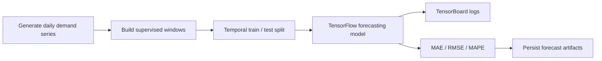

# time-series-forecasting-tensorflow

## Português

`time-series-forecasting-tensorflow` é um projeto de previsão temporal com `TensorFlow/Keras` e acompanhamento de treino com `TensorBoard`, desenhado para mostrar como estruturar um experimento de forecasting com janelas temporais, avaliação fora da amostra e persistência de artefatos.

### Storytelling técnico

Em séries temporais, prever o próximo valor não depende só do modelo escolhido. Também depende de como a sequência é transformada em janelas supervisionadas, de como o corte temporal entre treino e teste é preservado e de como o experimento é observado ao longo do treino. É exatamente nesse tipo de cenário que `TensorBoard` ajuda, porque torna visíveis curvas de convergência, divergência entre treino e validação e estabilidade do processo.

Este projeto foi desenhado com essa lógica:

- materializa uma série temporal sintética de demanda diária;
- transforma a série em janelas supervisionadas com `window_size = 14`;
- tenta executar o caminho principal com `TensorFlow/Keras`;
- grava logs em `logs/fit/` para leitura posterior no `TensorBoard`;
- mantém um fallback local com `MLPRegressor` quando `tensorflow` não está disponível.

### Arquitetura do projeto

- [src/data_factory.py](/Users/flaviagaia/Documents/CV_FLAVIA_CODEX/time-series-forecasting-tensorflow/src/data_factory.py)
- [src/modeling.py](/Users/flaviagaia/Documents/CV_FLAVIA_CODEX/time-series-forecasting-tensorflow/src/modeling.py)
- [main.py](/Users/flaviagaia/Documents/CV_FLAVIA_CODEX/time-series-forecasting-tensorflow/main.py)
- [tests/test_project.py](/Users/flaviagaia/Documents/CV_FLAVIA_CODEX/time-series-forecasting-tensorflow/tests/test_project.py)

### Pipeline



### Resultados atuais

- `runtime_mode = fallback_without_tensorflow`
- `row_count = 240`
- `window_size = 14`
- `train_window_count = 180`
- `test_window_count = 46`
- `mae = 11.1760`
- `rmse = 12.4578`
- `mape = 11.1146`

### Artefatos gerados

- série temporal materializada:
  [data/raw/daily_demand_series.csv](/Users/flaviagaia/Documents/CV_FLAVIA_CODEX/time-series-forecasting-tensorflow/data/raw/daily_demand_series.csv)
- previsões fora da amostra:
  [data/processed/forecast_values.csv](/Users/flaviagaia/Documents/CV_FLAVIA_CODEX/time-series-forecasting-tensorflow/data/processed/forecast_values.csv)
- relatório consolidado:
  [data/processed/time_series_forecasting_report.json](/Users/flaviagaia/Documents/CV_FLAVIA_CODEX/time-series-forecasting-tensorflow/data/processed/time_series_forecasting_report.json)

### Como usar o TensorBoard

Quando `tensorflow` estiver disponível, os logs de treino são gravados em `logs/fit/<timestamp>`. O comando esperado para inspeção é:

```bash
tensorboard --logdir logs/fit
```

No ambiente validado aqui, o projeto executou com `fallback_without_tensorflow`, então o diretório de logs contém uma nota de runtime em vez de curvas completas de época.

## English

`time-series-forecasting-tensorflow` is a forecasting project built with `TensorFlow/Keras` and `TensorBoard`, designed to show how a temporal prediction experiment can be structured around supervised windows, out-of-sample evaluation, and reproducible artifacts.

### Current results

- `runtime_mode = fallback_without_tensorflow`
- `row_count = 240`
- `window_size = 14`
- `train_window_count = 180`
- `test_window_count = 46`
- `mae = 11.1760`
- `rmse = 12.4578`
- `mape = 11.1146`
